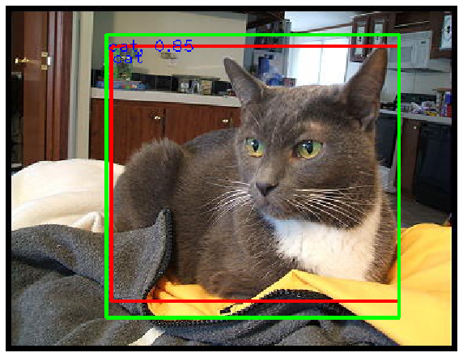
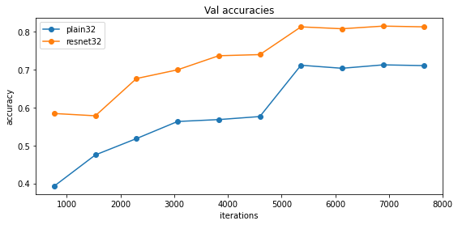
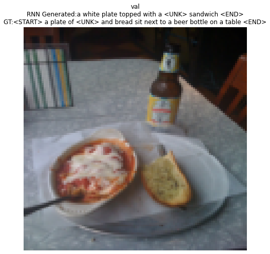

# Deep Learning for Computer Vision - EECS598

**Course Website:** https://web.eecs.umich.edu/~justincj/teaching/eecs498

**DISCLAIMER:** Since there are students taking these classes, I have withheld the source code and only left the Google Colab notebooks in this repository. If you are interested in the results from these exercises, feel free to download these notebooks and upload them to Google Drive. I have left the outputs of each code blocks for future reference.  

**NOTE:** Since these execises were meant to be educational, training time for these models are kept to **below 30 mins on Google Colab**. Remember to **change the directory of the assignment folder** in the .ipynb files to ensure mounting at the proper location in Google Drive. 

<!-- Highlight images at beginning -->

    
    

          

## [Assignment 1](https://github.com/derektan95/eecs598-deeplearning-for-computervision/tree/master/A1): Knn Classifiers
### Introduction to Pytorch
- Pytorch Tensor Basics
- Tensor Indexing, Reshaping Operations, Tensor Operations
- Vectorization, Broadcasting

### K Nearest-Neighbour Classification (~28% Accuracy)
- **Hyperparameters:** k=**10**
- **Validation:** Cross-Fold Validation
- **Data Set**: **40k** training, **10k** validation, **10k** test images [CIFAR-10 dataset](https://www.cs.toronto.edu/~kriz/cifar.html) **(Reshaped to 32x32px)**

## [Assignment 2](https://github.com/derektan95/eecs598-deeplearning-for-computervision/tree/master/A2): Softmax/SVM Linear Classifiers & 2-layered Neural Networks
### Softmax/SVM Linear Classifiers (~38% Accuracy)
- **Purpose:** Implementing **vectorized** architecture code & **hand-calc gradients** for a Linear Image Classifier
- **Architecture** = W1*X + b1
- **Loss Function:** Softmax Loss / SVM Hinge Loss
- **Backprop:** Derived-by-hand BackPropogation
- **Gradient Descent Algorithms:** Stochastic Gradient Descent
- **Optimization Parameters:** W1, b1
- **Hyperparameters:** Learning Rate=**9e-2**, Regularization=**1e-3**, Batch Size=**64**
- **Regularization:** L2 Regularization on W1
- **Validation:** Regular Validation
- **Training Duration**: **2k** iterations (epochs * train_size/batch_size)
- **Data Set**: **40k** training, **10k** validation, **10k** test images from [CIFAR-10 dataset](https://www.cs.toronto.edu/~kriz/cifar.html) **(Reshaped to 32x32px)**

### 2-Layer Neural Networks (~50% Accuracy)
- **Purpose:**Implementing **vectorized** architecture code & **hand-calc gradients** for a Linear Image Classifier
- **Architecture** = W2[max(0, W1*X + b1)] + b2
- **Loss Function:** Softmax Loss
- **Activation Function:** ReLU Activation Function
- **Backprop:** Computational Graph BackPropogation
- **Gradient Descent Algorithms:** Stochastic Gradient Descent
- **Optimization Parameters:** W1, W2, b1, b2
- **Hyperparameters:** Learning Rate=**5e-1**, Hidden Layer Size=**128**, Regularization=**1e-6**, Learning Rate Decay=**9.5e-1**, Batch Size=**200**
- **Regularization:** L2 Regularization on W1 & W2
- **Validation:** Regular Validation
- **Training Duration**: **2k** iterations (epochs * train_size/batch_size)
- **Data Set**: **40k** training, **10k** validation, **10k** test images from [CIFAR-10 dataset](https://www.cs.toronto.edu/~kriz/cifar.html) **(Reshaped to 32x32px)**

    

## [Assignment 3](https://github.com/derektan95/eecs598-deeplearning-for-computervision/tree/master/A3): Fully-Connected Neural Networks & Convolutional Neural Networks
### Fully-Connected Neural Networks (~50% Accuracy)
- **Purpose:** Implementing **vectorized** architecture code & **hand-calc gradients** for a Linear Image Classifier
- **Architecture** = max(0, W1*X + b1)... + b_n **(N layers using object-oriented programming)**
- **Loss Function:** Softmax Loss
- **Activation Function:** ReLU Activation Function
- **Backprop:** Computational Graph BackPropogation
- **Gradient Descent Algorithms:** SGD, SGD + Momentum, RMSProp, ADAM
- **Optimization Parameters:** W1, W2, b1, b2 ...
- **Hyperparameters:** Learning Rate=**5e-3**, Hidden Layer Size=**512**, Regularization=**1e-6**, Learning Rate Decay=**0.95**, Dropout=**0.5**, Batch Size=**512**
- **Regularization:** L2 Regularization, Dropout Regularization
- **Validation:** Regular Validation
- **Training Duration**: **7.8k** iterations (100 epochs * train_size/batch_size)
- **Data Set**: **40k** training, **10k** validation, **10k** test images from [CIFAR-10 dataset](https://www.cs.toronto.edu/~kriz/cifar.html) **(Reshaped to 32x32px)**

    
    

### Convolutional Neural Networks (~71% Accuracy)
- **Purpose:** Implementing **vectorized** architecture code & **hand-calc gradients** for a Convolutional Image Classifier
- **Architecture** = {conv - [batchnorm?] - relu - [pool?]} x (L - 1) - linear **(N layers - tried 21 layers)**
- **Loss Function:** Softmax Loss
- **Activation Function:** ReLU Activation Function
- **Backprop:** Computational Graph BackPropogation
- **Additional Layers:** Sparial Batch Normalization, 2x2 Max Pooling
- **Gradient Descent Algorithms:** ADAM
- **Optimization Parameters:** W1, W2, b1, b2 ... gamma1, beta1, gamma2, beta2...(BatchNorm)
- **Weight Initializer:** Kaiming Initializer
- **Hyperparameters:** Learning Rate=**2e-2**, Convolutional Kernal Size=**[16, 32, 64, 128]**, Regularization Strength=**2e-5**, Learning Rate Decay=**0.95**, Batch Size=**128**
- **Regularization:** L2 Regularization
- **Validation:** Regular Validation
- **Training Duration**: **2.5k** iterations (8 epochs * train_size/batch_size)
- **Data Set**: **40k** training, **10k** validation, **10k** test images from [CIFAR-10 dataset](https://www.cs.toronto.edu/~kriz/cifar.html) **(Reshaped to 32x32px)**

    
    

## [Assignment 4](https://github.com/derektan95/eecs598-deeplearning-for-computervision/tree/master/A4): Autograd, RNN Image Captioning, Network Visualization, Style Transfer
### Residual Network - PyTorch Autograd (~81.5% Accuracy)
- **Purpose:** Implementing **vectorized** architecture code & **audo_grad gradients** for a ResNet Image Classifier
- **ResNet32 Architecture** = ResNetStem - [(BatchNorm - ReLU - Conv) x **2**] - AvgPool - Linear 
- **ResNet47 Architecture** = ResNetStem - [(BatchNorm - ReLU - Conv) x **3**] - AvgPool - Linear 
- **Loss Function:** Softmax Loss
- **Activation Function:** ReLU Activation Function
- **Backprop:** Computational Graph BackPropogation (using AutoGrad)
- **Additional Layers:** Spatial Batch Normalization, 2x2 Max Pooling
- **Gradient Descent Algorithms:** SGD
- **Optimization Parameters:** Linear/Conv Weights & Biases, BatchNorm const
- **Weight Initializer:** Kaiming / Xavier Initializer
- **Hyperparameters:** Learning Rate=**1e-2**, momentum=**0.9**, weight_decay=**1e-4**, Batch Size=**64**
- **Regularization:** L2 Regularization
- **Validation:** Regular Validation
- **Training Duration**: **6.25k** iterations (10 epochs * train_size/batch_size)
- **Data Set**: **40k** training, **10k** validation, **10k** test images from [CIFAR-10 dataset](https://www.cs.toronto.edu/~kriz/cifar.html) **(Reshaped to 32x32px)**

    
    

### Recurrent Neural Network - Image Captioning
- **Purpose:** To produce Image Captions given a feature map of input image from ImageNET CNN backbone
- **RNN Architecture** = tanh(W_x*x + W_h*prev_h + b)  [Additional W_attn * x_attn for LSTM-Attention Block]
- **Pretrained Image Feature Extraction Architecture** = [MobileNet v2](https://pytorch.org/hub/pytorch_vision_mobilenet_v2/)
- **Loss Function:** Softmax Loss (at each output)
- **Activation Function:** tanh Activation Function
- **Backprop:** Computational Graph BackPropogation (By Hand / With AutoGrad)
- **Additional Layers:** LSTM / Attention LSTM Blocks (Replace RNN block to **counter exploding gradient problem**)
- **Gradient Descent Algorithms:** ADAM
- **Optimization Parameters:** Weights & Biases, Word Embedding Weight (word -> vector representation)
- **Weight Initializer:** Kaiming / Xavier Initializer
- **Hyperparameters:** Learning Rate=**1e-3**, Hidden Layer Size=**512**, Learning Rate Decay=**1.0**, Batch Size=**250**
- **Regularization:** -
- **Validation:** Regular Validation
- **Training Duration**: **2.4k** iterations (60 epochs * train_size/batch_size)
- **Data Set**: **10k** training, **500** test image-caption pairs from [Microsoft COCO dataset](http://mscoco.org/) **(Reshaped to 112x112px)**

    
    
        

### Network Visualization
- **Purpose:** To better appreciate how hidden layers in Deep Neural Network makes accurate predictions
- **Pretrained Image Feature Extraction Architecture** = [SqueezeNet](https://github.com/forresti/SqueezeNet)
- **Saliency Maps**: dLoss/dInput using Backprop
- **Adversarial Attack**: dScore/dInput for Gradient Ascent on Input Image using Backprop
- **Class Visualization**: dScore/dInput for Gradient Ascent on Input Image using Backprop (with Regularization & periodic blurring) 
- **Data Set**: [ImageNet 2012](https://image-net.org/challenges/LSVRC/2012/) 

    

    
        
          
          

### Neural Style Transfer
- **Purpose:** Applying RNN to artworks
- **Pretrained Image Feature Extraction Architecture** = [SqueezeNet](https://github.com/forresti/SqueezeNet)
- **Content Loss**: Loss = w_C * SUMMATION[ (Current_Feature_Map - Target_Feature_Map)^2 ]
- **Feature Loss**: Loss = w_C * SUMMATION[ (Current_Gram_Matrix - Target_Gram_Matrix)^2 ]  (Sum accross chosen layers)
- **Total Variation Regularization**: sum of the squares of differences in the pixel values for all pairs of adjacent pixels (horizontally or vertically)
- **Backprop:** Computational Graph BackPropogation (With AutoGrad)
- **Gradient Descent Algorithms:** ADAM (on Input Image)

    
          

## [Assignment 5](https://github.com/derektan95/eecs598-deeplearning-for-computervision/tree/master/A5): Object Detection
### Single Stage Detector - YOLO v1 (~13.1% mAP on Validation Set)
- **Purpose:** Demarcate objects with Bounding Boxes given a feature map of input image from ImageNET CNN backbone 
- **Multi-Loss Function:** (Confidence, Class, BBox Offsets)
- **Pretrained Image Feature Extraction Architecture** = [MobileNet v2](https://pytorch.org/hub/pytorch_vision_mobilenet_v2/)
- **Backprop:** Computational Graph BackPropogation (using AutoGrad)
- **Additional Layers:** Conv - Dropout - Leaky ReLU - Conv (Replacing last layer of MobileNet)
- **Gradient Descent Algorithms:** ADAM
- **Optimization Parameters:** Conv Weights & Biases
- **Weight Initializer:** Kaiming / Xavier Initializer
- **Hyperparameters:** Learning Rate=**5e-2**, Learning Rate Decay=**1.0**, Batch Size=**10**
- **Regularization:** Dropout
- **Validation:** Regular Validation
- **Training Duration:** **12.5k** iterations (50 epochs * train_size/batch_size)
- **Data Set**: **2.5k** training, **2.5k** validation images from [PASAL VOC 2007 dataset](http://host.robots.ox.ac.uk/pascal/VOC/) **(Reshaped to 224x224px)**

    
          

### Two Stage Detector - Faster RCNN (~21.7% mAP on Validation Set)
- **Purpose:** Demarcate objects with Bounding Boxes given a feature map of input image from ImageNET CNN backbone 
- **Stage 1:** Similar to YOLO, but detecting (Confidence, BBox Offsets)
- **Stage 2:** Separately detecting Class per Bounding Box
- **Multi-Loss Function:** (Confidence, BBox Offsets) on Stage 1 + (Class) Offsets on Stage 2
- **Pretrained Image Feature Extraction Architecture** = [MobileNet v2](https://pytorch.org/hub/pytorch_vision_mobilenet_v2/)
- **Backprop:** Computational Graph BackPropogation (using AutoGrad)
- **Additional Layers (Stage 1):** Conv - Dropout - Leaky ReLU - Conv (Replacing last layer of MobileNet)
- **Additional Layers (Stage 2):** Linear - Dropout - ReLU - Linear 
- **Gradient Descent Algorithms:** ADAM
- **Optimization Parameters:** Linear/Conv Weights & Biases
- **Weight Initializer:** Kaiming / Xavier Initializer
- **Hyperparameters:** Learning Rate=**5e-3**, Learning Rate Decay=**1.0**, Batch Size=**10**
- **Regularization:** Dropout
- **Validation:** Regular Validation
- **Training Duration:** **25.0k** iterations (100 epochs * train_size/batch_size)
- **Data Set**: **2.5k** training, **2.5k** validation images from [PASAL VOC 2007 dataset](http://host.robots.ox.ac.uk/pascal/VOC/) **(Reshaped to 224x224px)**

    
          

## [Assignment 6](https://github.com/derektan95/eecs598-deeplearning-for-computervision/tree/master/A6): Generative Models
### Variational Auto-Encoders (VAE)
- **Purpose:** Train Encoder and Decoder networks to produce images p(x) given prior p(z). Also trained **conditional VAE**.
- **Encoder Architecture** = (Linear - ReLU) x3
- **Decoder Architecture** = (Linear - ReLU) x3 - Sigmoid
- **Multi-Loss Function:** Data Reconstruction Loss (x vs x_hat) & KL Divergence (Decoder vs Prior)
- **Backprop:** Computational Graph BackPropogation (using AutoGrad)
- **Gradient Descent Algorithms:** ADAM
- **Optimization Parameters:** Linear/Conv Weights & Biases
- **Weight Initializer:** Kaiming / Xavier Initializer 
- **Hyperparameters:** Learning Rate=**1e-3**, Batch Size=**128**, Latent Layer Size=**15**
- **Regularization:** N/A
- **Validation:** Regular Validation
- **Training Duration:** **~4.7k** iterations (10 epochs * train_size/batch_size)
- **Data Set**: **60k** training, **10k** validation images from [MNIST dataset](http://yann.lecun.com/exdb/mnist/) **(28x28px)**

    

    Changes in output image with changes in latent vector p(z)

### Generative Adversarial Network
- **Purpose:** Jointly train Generator (G) and Discriminator (D). D is trained to get better than telling apart real images (from train data) and fake images (generated by G with prior ~N(0,1)). G is trained to get better at fooling D to misclassify it.
- **GAN Architecture Types** = Vanilla GAN, Least Squares GAN, Deeply Convolutional GAN
- **Multi-Loss Function:** Generator Loss + Discriminator Loss
- **Backprop:** Computational Graph BackPropogation (using AutoGrad)
- **Gradient Descent Algorithms:** ADAM
- **Optimization Parameters:** Linear/Conv Weights & Biases
- **Weight Initializer:** Kaiming / Xavier Initializer 
- **Hyperparameters:** Learning Rate=**1e-3**, Batch Size=**128** Prior Size=**96**
- **Regularization:** N/A
- **Validation:** Regular Validation
- **Training Duration:** **~4.7k** iterations (10 epochs * train_size/batch_size)
- **Data Set**: **60k** training, **10k** validation images from [MNIST dataset](http://yann.lecun.com/exdb/mnist/) **(28x28px)**

    
        
          
          

